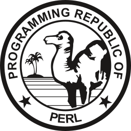

  <h1>Yellow there 👋👋👋</h1>
  
  

  <h2>I am Joseph Rasanjana.</h2>
  <h3>I am a programmer who loves to make robots with AI.</h3>

  

  <ul type="none">
    <li>🔭 I’m currently studying at <a href="https://www.ruh.ac.lk/">💻 University Of Ruhuna</a>,</li>
    <li>👯 I’m looking to collaborate on <b>Python</b> projects</li>
    <li>💬 Ask me about anything</li>
  </ul>

  <!--<a href="https://www.buymeacoffee.com/joerasa" target="_blank">--</a>-->

<h3 align="center">Languages and Tools:</h3>

  
  
  
  
  
  
  
  
  
  
                  
  
  
  
  
  
  
  
  
  
  

  
  

<!-- 

-->
<h3 align="center">Visitor Count</h3>

 
   
  

