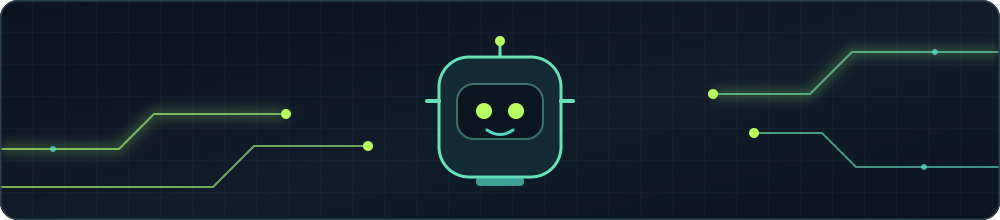
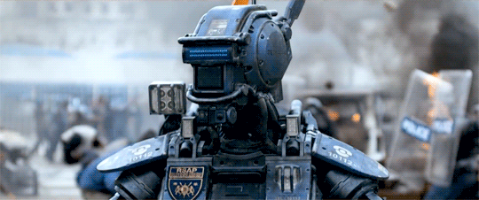

  

<h1 align="center">Hi, I'm Joseph Rasanjana 👋</h1>

  <strong>DevOps engineer · AI explorer · robotics builder</strong> 
  I like turning ambitious ideas into systems that actually work.

  <a href="https://josephlahiru.github.io/">Portfolio</a> ·
  <a href="https://github.com/JosephLahiru?tab=repositories">Projects</a> ·
  <a href="https://www.linkedin.com/in/josephrasanjana/">LinkedIn</a> ·
  <a href="https://www.youtube.com/@joe_rasa">YouTube</a>

## What I do

- Build and improve developer infrastructure as a DevOps engineer at **IFS R&D**.
- Explore practical AI, from local language models to useful developer tools.
- Make robotics easier to learn and experiment with through Python and simulation.

## Selected work

| Project | Why it matters |
| :--- | :--- |
| [CoppeliaSim Python tutorials](https://github.com/JosephLahiru/coppeliasim-python) | Step-by-step examples for controlling simulated robots with Python. |
| [DevOps Pal MCP](https://github.com/JosephLahiru/devops-pal-mcp) | A local LLM and Docker demo exploring practical DevOps assistance. |

Explore [all repositories](https://github.com/JosephLahiru?tab=repositories) or [watch my tutorials](https://www.youtube.com/@joe_rasa).

## Tools I reach for

  
  
  
  
  
  
  
  
  
  

  
More languages and tools

   
  

    
    
    
    
    
    
    
    
    
    
    
    
    
    
    
    
    
    
    
    
    
    
    
    
    
    
    
  

## Beyond the code

I enjoy sharing what I learn, especially when it helps someone try robotics or AI for the first time. You can find my [videos on YouTube](https://www.youtube.com/@joe_rasa) and my [Holopin board](https://holopin.io/@theAlphaGuardian).

  

---

  Visitors 
  

